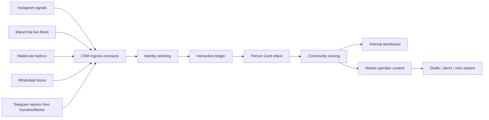

# CRM vNext Architecture Brief

Date: 2026-05-08
Status: Sprint 1 build brief

## North Star

Build a community intelligence command center for Alejandro and Mantis: one place where every known person can accumulate identity, interaction history, email behavior, Instagram signals, product participation, spend, and suggested next action.

The CRM should feel less like a spreadsheet and more like a living map of the community. It should help answer:

- Who is this person across channels?
- What have they done with us?
- How close are they to deeper relationship or purchase?
- What is the next respectful action?
- What can Mantis safely do without asking Alejandro?

## Operating Roles

- Mantis remains the daily operator and orchestrator through OpenClaw.
- This Codex build lane owns repository work, contracts, tests, docs, and local product increments.
- Alejandro is only interrupted for strategic decisions, credentials, local permissions, or actions that touch external people/channels.

## Current Freeze Boundary

CRM vNext starts from the minimal-mode freeze documented by Mantis on 2026-05-08.

Keep alive:

- Read-only IG UI signal harvest.
- Autopilot close loop / reporting cadence.
- ManyChat LIVE flows that are currently business-critical.

Do not touch without explicit approval:

- ManyChat LIVE behavior.
- Instagram credentials or permissions.
- MailerLite credentials.
- Outbound messages to leads, clients, or community members.
- WhatsApp or other external send surfaces.

Known blockers:

- Instagram API conversation read remains blocked/red.
- Legacy IG web probe is stale/broken.
- MailerLite snapshot exists but should be refreshed through a safe credential-aware path later.

## System Shape

## Product Strategy

Sprint 1 should build the motor before the visual polish:

- stabilize contracts and scoring locally;
- preserve the ManyChat bridge while we reduce dependency carefully;
- make Mantis-readable outputs first;
- then build the dashboard on top of known-good data.

Dashboard remains important, but it should read from the same person-card and scoring contracts Mantis uses. That prevents two CRMs from forming: one for humans and one for agents.

## Scoring Philosophy

Do not collapse everything into one "hot lead" score.

Use one public lifecycle label for scanning:

- Semilla
- Germinada
- Florecida
- Cosecha

But keep separate dimensions internally:

- commercialWarmth: likelihood that a timely offer/follow-up is appropriate.
- communityDepth: strength of relationship and participation.
- relationshipEngagement: recent attention across email, IG, and live/community spaces.
- dataConfidence: how trustworthy and complete the profile is.
- productFit: fit by offer family, not only generic readiness.

This matters because a person can be deeply connected to the community without being ready to buy a high-ticket offer this week.

## Priority Data Sources

1. MailerLite
   - Email is a primary relationship channel.
   - Metrics to ingest: opens, clicks, replies if available, groups/tags, subscriber status, last activity.

2. Instagram
   - Target "wow" moment is stable automatic extraction of allowed IG interactions.
   - Signals to pursue: DMs where permitted, comments, likes, story views, follows/new followers, profile identifiers.
   - Constraint: Meta permissions and API surface determine what is legally/technically available.

3. ManyChat
   - Keep live onboarding flow for now.
   - Treat ManyChat as temporary trigger/transport where useful, not the long-term brain.
   - Move business logic and canonical data contracts into CRM.

4. Telegram/Mantis/manual human reports
   - Allow assistants or Mantis to add structured facts from real-world conversations, retreats, classes, and operations.

5. Web/WhatsApp future
   - Add after identity, consent, and scoring contracts are stable.

## First Dashboard Shape

Internal-only v0 should include:

- community health overview;
- contact search;
- top priority people;
- recently active people;
- identity gaps;
- omnichannel coverage;
- lifecycle distribution;
- per-contact card with identities, activity, scores, evidence, products, next action.

Minimal and modern is the right direction, but no dashboard should hide uncertainty. Data confidence and evidence should always be visible.

## Decisions Pending Later

- Which Meta API permissions can be granted or recovered for IG read surfaces.
- Whether to keep ManyChat for follower-trigger coverage or replace in phases.
- Which products get first-class CRM objects first: yoga classes, 1:1 mentorship, 1:1 therapy, Mi Encuentro Feliz, digital products, retreats.
- How aggressive Mantis can be in drafting, recommending, or sending responses by channel.
